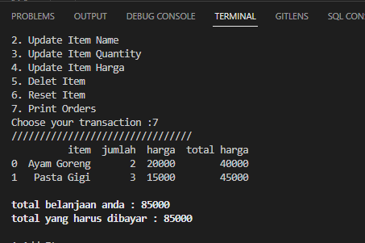

# Cashier-System
Sistem kasir sederhana menggunakan python 
## Table of contents
* [General info](#general-info)
* [Technologies](#technologies)
* [Setup](#setup)
* [Requirements/Objectives](#requirements/objectives)
* [Snipet Code](#snipet-code)

## General info
Program merupakan project akhir kelas python dari program kelas Pacmaan. Program ini merupakan sistem kasir sederhana dimana pelanggan bisa memasukkan pesanannya sendiri dan mencetak data pesanan beserta total belanjaannya menggunakan python 

Program ini menggunakan menggunakan sistem modular pada python yang terdiri dari beberapa kelas yang masing-masing berfungsi untuk mengeksekusi setiap perintah berdasarkan input dari user
## Technologies
Project ini menggunakan python 3.9
## Setup
Program bisa langsung didownload dan dijalankan langsung pada berbagai IDE/code editor yang dimiliki 
## Requirements/Objectives
Program sistem kasir bekerja agar user bisa memasukkan sendiri item belanjaannya. Untuk membuat sistem kasir bekerja sesuai input dari user, maka tertadap beberapa kelas yang dibuat untuk bisa mengeksekusi perintah yang sesuai. Pada program ini dibuat tiga kelas yaitu kelas Main(), Menu(), dan App()
* Kelas Main()  
    Kelas yang menunjukkan tampilan atau interface dari sistm kasir
* Kelas Menu ()  
    kelas menu terdiri dari beberapa fitur yang akan dijalankan sesuai dengan input dari user
* Kelas App()  
    mengkonstruksi setiap nilai inputan dari kelas Menu() dan Main() sesuai dengan perintah yang dipilih

Flow Kerja Program :  
* Program bekerja dengan diawali dari user yang memilih menu sistem kasir yang akan digunakan dari pilihan menu di kelas Main(). Terdapat tujuh pilihan : 1. Add Item, 2. Update Item Name, 3. Update Item Quantity, 4. Update Item Harga, 5. Delete Item, 6. Reset Item, 7. Print Orders
* Setiap pilihan dari user akan menjadi masukan untuk Kelas Menu() yang selanjutnya akan memilih perintah mana yang akan dieksekusi sesuai dengan inputan user. Pada kelas menu terdapat method validation untuk mengecek apakah input dari user sudah benar atau tidak
* Kelas Menu() akan memilih perintah eksekusi yang tersedia di Kelas App(). Kelas App() terdiri dari method yang disesuaikan dengan fitur yang disediakan pada pilihan Main()            
## Snipet Code
Program sistem kasih dilengkapi berbagai fitur menu yang akan dipilih oleh user. Pada bagian awal atau interface akan ditampilkan seperti berikut  
  
Untuk memasukan item belanja bisa input angka 1 dan masukan nama item belanja, jumlah item, dan harga item. Misalkan masukan Ayam Goreng, 2, 20000 dan Pasta Gigi, 3, 15000. Untuk melihat apakah item sudah dimasukan dengan benar pilih nomor 7, maka tampilan akan seperti berikut  
  
Terdapat fitur delete pada point nomor 5 apabila ingin menghapus item. Misalkan ingin menghapus Pasta Gigi, maka cukup masukan nama item yang akan dihapus. Untuk mengecek bisa pilih print order kembali 
  
Untuk menghapus semua terdapat fitur Reset Item point nomor 6, maka saat print order akan muncul tampilan seperti berikut  

